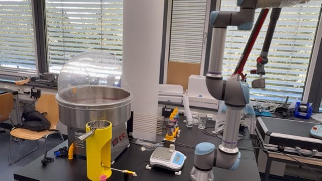
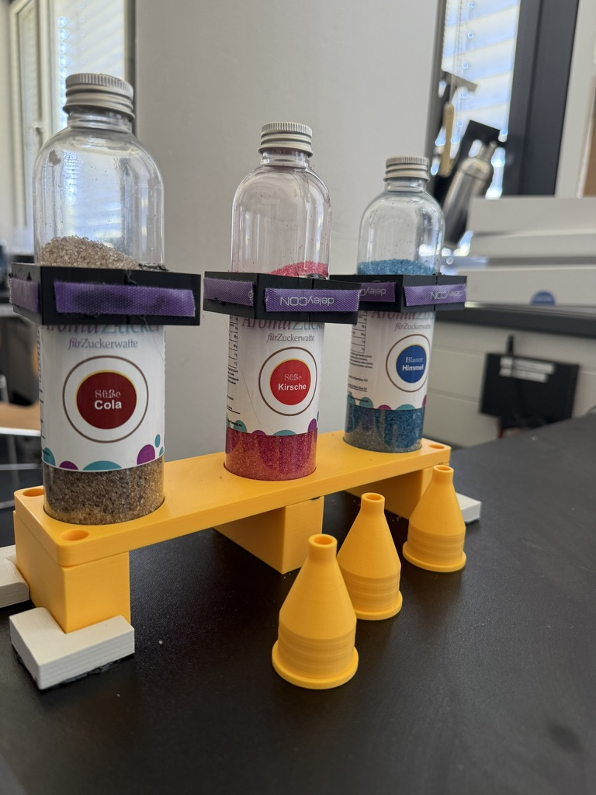
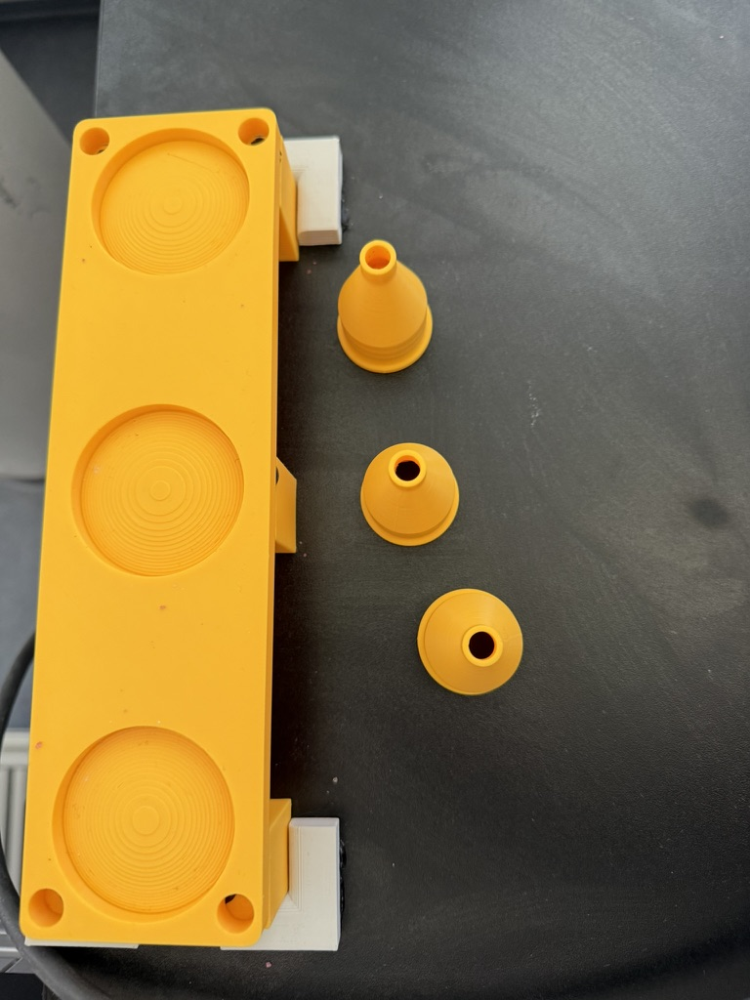
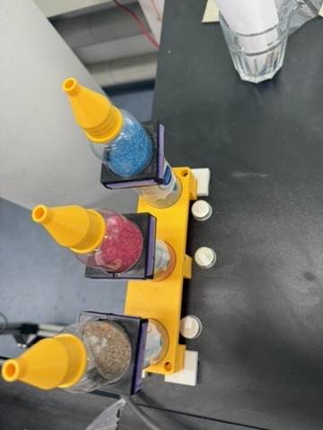

# Cotton Candy Flavor Station

A flavor selection and dosing extension for a robotic cotton candy process, built with a UR5 co-bot and the Cloud Process Execution Engine (CPEE).

Practical Course "Sustainable Process Automation: Humans, Software and the Mediator Pattern", Chair of Information Systems and Business Process Management, Technical University of Munich (TUM-Prak-26-SS).

Author: Lucas Bader



## Abstract

This project extends an existing cotton candy production process, in which a UR5 co-bot operates a cotton candy machine, by a fully automated flavor stage. A customer chooses between three flavored sugars (Cola, Strawberry Pink and Blueberry Blue) in a simple web UI and decides whether they want a single flavor or a mix of two. The robot then picks the matching sugar bottle from a 3D printed flavor station, pours the selected amount through a printed funnel into a dosing unit, and hands over to the existing production process, which fills the machine and spins the cotton candy. The whole flow is orchestrated by a CPEE process that synchronizes the user interface, the robot programs and the reused subprocess.

## Motivation

The starting point was David's cotton candy process, which could already produce cotton candy autonomously, but only with whatever sugar was manually loaded into the machine beforehand. From a customer's point of view the interesting decision is the flavor, so the goal of this project was to move that decision into the process itself. This meant solving three problems: a user interface where the customer states their wish, a physical station where three different sugars are stored and can be gripped reliably by the robot, and a dosing mechanism that pours a repeatable amount of sugar for both the single and the mix option. The project therefore combines process modeling in CPEE, robot programming on the UR5 and iterative 3D printed hardware design.

## System Overview

| Component | Role |
|---|---|
| UR5 co-bot with Robotiq gripper | Picks the sugar bottles, pours the sugar, operates the cotton candy machine |
| CPEE (cpee.org) | Orchestrates UI, robot programs and the reused subprocess |
| Flavor station (3D printed) | Holds three sugar bottles at fixed, known positions |
| Funnels (3D printed) | Screwed onto the bottles, restrict the flow so the pour is dosable |
| Cotton candy machine | Spins the sugar into cotton candy, operated by the reused subprocess |
| Web UI (HTML frames) | Flavor and mode selection, live status screens |



## Repository Structure

```
LB_Prak26_CottonCandyFlavour/
├── cpee/                        CPEE process model (XML, BPMN, SVG) and instance properties
├── ui/                          HTML frames and shared stylesheet for the customer UI
├── robot/
│   ├── lucas/                   UR5 programs written for this project
│   └── david-subprocess/        Reused cotton candy programs (cottonFill.urp modified)
├── hardware/
│   └── 3d-prints/               Final STL files, earlier iterations in archive/
├── media/                       Photos of the setup
└── README.md
```

## Technologies Used

| Part | Stack |
|---|---|
| Process orchestration | CPEE, Ruby execution handler |
| Robot | UR5 (Polyscope 5.12), Robotiq gripper URCap |
| Robot to process interface | Lab REST endpoints for programs and general purpose registers |
| User interface | Plain HTML, CSS and JavaScript, served as CPEE frames |
| Hardware design | Parts modeled in Onshape, 3D printed in PLA (funnels, gripper collars, bottle holder) |

## How It Works

The CPEE process `FlavorPouring` (see [cpee/FlavorPouring.xml](cpee/FlavorPouring.xml)) runs through four phases. Phases 1 to 3 each use a parallel block so that the screen and the robot are busy at the same time.

1. **UI setup and homing.** The process initializes a 4 x 6 frame grid on your screen. In parallel it serves the header and the selection page (`select.html`) while the robot first moves to the cotton home position (`cottonHome.urp`) and from there to the flavor home position (`flavorHome.urp`), so the robot is already standing in front of the flavor station when the customer confirms.
2. **Selection.** The selection page lets the customer pick a mode (Single or Mix) and then either one or two flavors. On confirm the page sends `mode` (0 for single, 1 for mix), `flavor1` and `flavor2` as flavor indices (0 = Cola, 1 = Strawberry Pink, 2 = Blueberry Blue) back to the process through the CPEE callback. The process stores them in its data elements and derives `pouring_mode`.
3. **Pouring.** The process writes the flavor index into the robot's general purpose integer register 0 and the mode into register 1, then starts `FlavourPouring.urp` and waits until the program is done. In the single case this happens once. In the mix case the same sequence runs twice, first with `flavor1`, then with `flavor2`. While the robot pours, the screen shows an animated pouring page.
4. **Production and done.** The process starts David's cotton candy process as a CPEE subprocess (`behavior: wait_running`), which fills the dosed sugar into the machine and spins the cotton candy, while the screen shows a making page. When the subprocess reports back, a done screen is displayed.

The amount of sugar is controlled purely over time in the robot program. In single mode the robot holds the bottle in the tilted pouring position for an additional 1.5 seconds, so one pour releases roughly twice the sugar of a mix pour. In mix mode the extra hold is skipped, but the pour happens twice, once per flavor, so both modes end up with a comparable total amount in the dosing unit.

## UR5 Robot Programs

All programs written for this project live in [robot/lucas/](robot/lucas/) and are stored on the lab UR5 under `/programs/BaderLucas`.

1. **cottonHome.urp** activates the gripper and moves the robot over safe intermediate waypoints to the shared cotton home position that the reused subprocess also starts from.
2. **flavorHome.urp** moves the robot from the cotton home position to the flavor station and ends in the flavor home position directly in front of the first bottle.
3. **FlavourPouring.urp** is the core program. It reads the flavor index from `GP_int_in[0]` and computes the bottle position as an offset from the first bottle: `x_offset = 0.090 * flavor`, since the three bottle slots are spaced 90 mm apart in the holder. From that pose it derives the grab pose, a hover pose 180 mm above it and a retreat pose. The robot approaches the bottle, closes the gripper around the printed gripper collar, lifts the bottle out of the holder and moves it over the dosing unit. It then tilts the bottle so the sugar runs through the funnel. The program reads the mode from `GP_int_in[1]`: if the mode is 0 (single) it waits an extra 1.5 seconds in the tilted position, otherwise it continues immediately. Finally the bottle is turned upright again, carried back and set down into its slot, and the gripper releases.
4. **mixerHome.urp** returns the robot from the flavor station back to the cotton home position so the subprocess can take over.

### Reused subprocess

The cotton candy production itself is David's process, started as a subprocess and left unchanged except for one program. In [robot/david-subprocess/cottonFill.urp](robot/david-subprocess/cottonFill.urp) the gripper now stays closed for a longer time while the sugar is released into the dosing cap in the machine. With this change one filling cycle transfers roughly 15 grams of sugar, which matches the amount that the pouring stage doses per customer order. All other programs (machine on and off, heater, motor, the circular spinning motion in `cottonMake.urp` and the final presentation in `cottonDisplay.urp`) are used as provided.

## 3D Printed Hardware

The printed parts were the main hardware work of the project and went through several iterations. The final versions are at the top level of [hardware/3d-prints/](hardware/3d-prints/), all earlier stages are kept in [hardware/3d-prints/archive/](hardware/3d-prints/archive/).



**Final parts:**

- `final_funnel_9.5mm_opening.stl` screws onto the sugar bottles and restricts the outlet to 9.5 mm. This came out of three iterations: with the 10.5 mm opening the sugar ran out too fast to dose over hold time, the 7.5 mm opening restricted the flow too much, and the 9.5 mm opening gives a steady, controllable flow.
- `final_sugar_gripper_v2.stl` is a collar mounted on each bottle that gives the Robotiq gripper a defined, repeatable gripping surface, so every bottle is held identically no matter which slot it comes from.
- `final_sugar_bottle_holder.stl` is the station itself. It holds the three bottles at exactly 90 mm spacing, which is what allows the robot program to compute every bottle position from a single taught pose.

**Archive:**

- `funnel_v3_10.5mm_opening.stl` and `funnel_v1_7.5mm_opening.stl`, the two rejected funnel iterations (opening too large and too small).
- `funnel_early_prototype_26-06.stl`, an early funnel shape test.
- `sugar_gripper_v1_24.5mm.stl`, the first gripper collar version.
- `sugar_dosing_cap_v1.stl`, a screw-on dosing cap concept that was dropped in favor of the funnel plus hold time approach.



## User Interface

The UI consists of small self-contained HTML pages in [ui/](ui/), served into the screen grid by the CPEE frames service and sharing one stylesheet (`style.css`).

- `header.html` shows the title bar with the three flavor colors.
- `select.html` is the only interactive page. A segmented control switches between Single and Mix, below it the three flavors are listed as cards. In mix mode two flavors have to be picked and a gradient bar previews the blend. The page resolves the CPEE callback URL (from `window.name`, the frame id, query parameters or a postMessage) and sends the selection as a JSON PUT, which completes the waiting service call in the process.
- `pouring.html` and `making.html` are animated status screens shown while the robot pours and while the machine spins.
- `done.html` confirms that the cotton candy is ready.

## Setup Instructions

1. **Physical setup.** Place the bottle holder at the flavor station position, insert the three sugar bottles with their gripper collars and funnels, and make sure the cotton candy machine and the dosing unit are in their usual spots.
2. **Robot.** The UR5 must be reachable through the lab endpoint (`lab.bpm.in.tum.de/ur5/lawine`) and the programs from `robot/lucas/` have to be present under `/programs/BaderLucas`. The taught poses `cotonHomePos` and `flavor1home` are stored in the installation, so if the station is moved, only `flavor1home` needs to be re-taught.
3. **UI.** The HTML files must be hosted where the process expects them (in this instance `https://lehre.bpm.in.tum.de/~go93xak/`). If they are hosted elsewhere, the frame URLs in the process model have to be adjusted.
4. **Process.** Load `cpee/FlavorPouring.xml` into a CPEE instance (the model also lives in the CPEE hub under `Teaching.dir/Prak.dir/TUM-Prak-26-SS.dir/BaderLucas.dir`) and start it. The screen shows the selection page, and everything else runs automatically.

## Results and Lessons Learned

- The full chain from screen input to finished cotton candy runs without manual intervention, for both a single flavor and a two flavor mix.
- Dosing sugar with a funnel opening plus hold time turned out to be much more reliable than expected, but only after tuning the opening to 9.5 mm. With the other openings the poured amount varied too much between runs.
- Computing the bottle positions from a single taught pose (instead of teaching three separate pick sequences) kept the robot program small and made adding a flavor a matter of one more slot in the holder.
- Running UI and robot actions in parallel branches noticeably shortens the perceived waiting time, since the robot is already in position when the customer confirms.
- The extra 1.5 second hold in single mode gives a good approximation of double the amount, so both modes deliver a similar total quantity of sugar.

## Possible Improvements

- Use the scale that is already part of the cell to weigh the poured sugar and stop by weight instead of by time, which would make the dosing independent of the fill level of the bottles.
- Report progress from the robot back into the UI, so the status pages could show real progress instead of an indeterminate animation.
- Detect an empty or missing bottle before pouring, for example with the gripper feedback.

## Future Directions

- More flavors are only a longer holder away, since positions are computed from the slot index.
- Mixing ratios other than 50/50 could be offered by exposing the hold time as a register value set from the UI.
- A queue in the UI would allow taking the next order while the current cotton candy is still being spun.

## Demo Video

A video of a full run, including the UI interaction and the robot, is available here: (link follows)

## Credits

- Course: Sustainable Process Automation: Humans, Software, and the Mediator Pattern (TUM)
- Student: Lucas Bader, Matriculation No: 03814647
- Supervisor: Dr. Jürgen Mangler
- Lab master: Zeka (Zack) Dizdar
- **David** built the original cotton candy production process that this project reuses as a subprocess.
- The **Chair of Information Systems and Business Process Management (TUM)** provides the lab, the UR5 and the CPEE infrastructure.

## References

- [CPEE Documentation](https://cpee.org/)
- [Mangler, Juergen, and Stefanie Rinderle-Ma. *Cloud Process Execution Engine: Architecture and Interfaces* (2022)](https://arxiv.org/abs/2208.12214)
- [Universal Robots URScript Guide](https://www.universal-robots.com/articles/)
